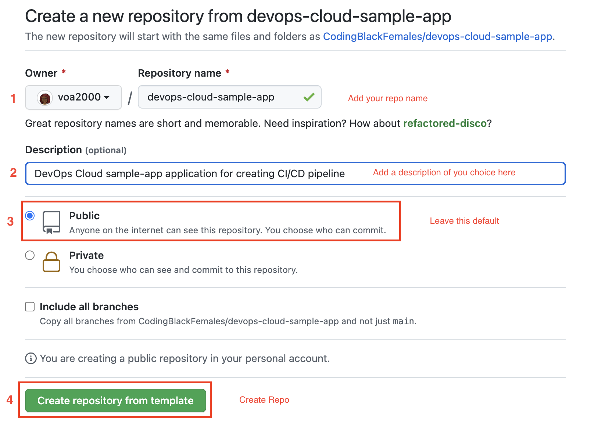

# DevOps-Cloud Sample App Project

[][1]
[][2]
[][3]
[][4]
[][5]

A sample project (skeleton) to practice DevOps CI/CD pipelines.

## Pre-requisites

This starter project uses [JavaScript][1], [Node.js][2] and [npm][4] as a package manager.

If you do not have Node.js installed locally, please follow these instructions:
- [Node.js installation][5]


## Installation

To use this starter project:

- Click on the `Use this template` button
- Fill out the details of your new project as below
- Then click on `Create repository from template`




## Development

Once your new repository created, clone it locally, and install its dependencies:
- replace `${your-username}` with your GitHub username
- replace `${repository-name}` with the repository name you created above

```bash
git clone git@github.com:${your-username}/${repository-name}.git
cd ${repository-name}
```

**For example, in my case the above commands would look like this:**

```bash
git clone git@github.com:voa2000/devops-cloud-sample-app.git
cd devops-cloud-sample
```

## Next steps

Once the setup completed:


[1]: https://www.javascript.com/
[2]: https://nodejs.org/en/
[3]: https://jestjs.io/
[4]: https://nodejs.org/en/download/
[5]: https://reactjs.org/


### 
```bash 
npm -v && node -v
```
- Verifies versions of npm and node installed. NodeJS installs NPM as its the package manager for installinf node packages for your application.

In the project directory, you can run:

### 
```bash 
npm install
```
- Installs all npm packges required to run the application

### 
```bash
npm start
```

- Runs the app in the development mode.\
Open [http://localhost:3000](http://localhost:3000) to view it in your browser.

- The page will reload when you make changes.\
- You may also see any lint errors in the console.

### 
```bash
npm test
```

- Launches the test runner in the interactive watch mode.\
See the section about [running tests](https://facebook.github.io/create-react-app/docs/running-tests) for more information.

### 
```bash
npm run build
```

- Builds the app for production to the `build` folder.\
It correctly bundles React in production mode and optimizes the build for the best performance.

- The build is minified and the filenames include the hashes.\
Your app is ready to be deployed!

- See the section about [deployment](https://facebook.github.io/create-react-app/docs/deployment) for more information.

## Learn More

You can learn more in the [Create React App documentation](https://facebook.github.io/create-react-app/docs/getting-started).

To learn React, check out the [React documentation](https://reactjs.org/).

### Code Splitting

This section has moved here: [https://facebook.github.io/create-react-app/docs/code-splitting](https://facebook.github.io/create-react-app/docs/code-splitting)

### Analyzing the Bundle Size

This section has moved here: [https://facebook.github.io/create-react-app/docs/analyzing-the-bundle-size](https://facebook.github.io/create-react-app/docs/analyzing-the-bundle-size)

### Making a Progressive Web App

This section has moved here: [https://facebook.github.io/create-react-app/docs/making-a-progressive-web-app](https://facebook.github.io/create-react-app/docs/making-a-progressive-web-app)


### Deployment

This section has moved here: [https://facebook.github.io/create-react-app/docs/deployment](https://facebook.github.io/create-react-app/docs/deployment)